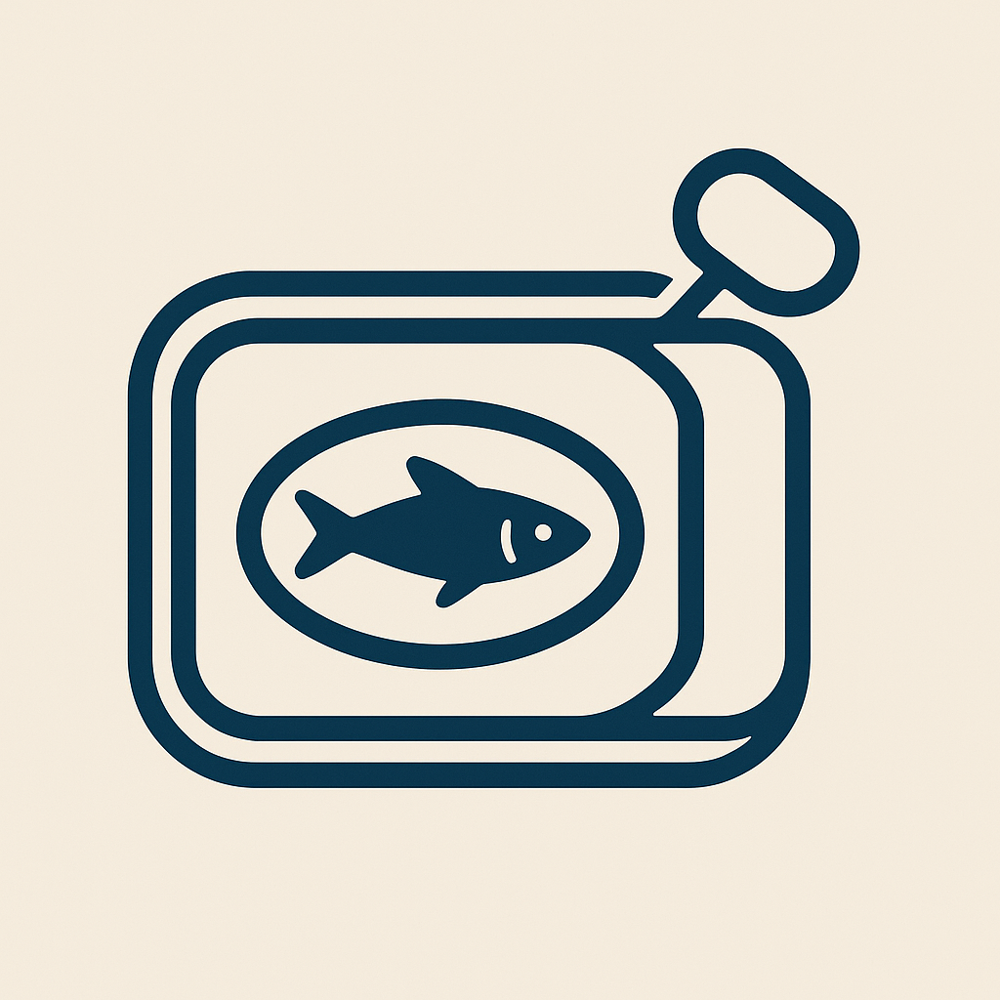

# sardine 

<!-- badges: start -->
[](https://doi.org/10.5281/zenodo.17255208)
[](https://github.com/jackmanners/sardine/actions)
<!-- badges: end -->

## Overview

**S**tructured **A**rchitecture for **R**esearch **D**ata **I**ntegration and **E**valuation

`sardine` provides a modern, object-oriented interface for research data APIs, starting with comprehensive REDCap support. The package emphasizes performance, data integrity, and ease of use through project objects that cache data and provide clean method interfaces.

## Key Features

- **Object-Oriented Design**: Project objects that test connections automatically and cache data for performance
- **Fail-Fast Error Handling**: Connection issues caught immediately during project creation
- **Data Caching**: Full datasets cached on project creation, with manual refresh capabilities
- **Clean Method Names**: No `redcap_` prefixes - `export_records()` vs `redcap_export_records()`
- **Import Warnings**: Alerts when imports make cached data outdated
- **Comprehensive REDCap Coverage**: All major REDCap API endpoints supported
- **Modular Architecture**: Base classes ready for additional API sources (Qualtrics, etc.)
- **Security First**: Environment variable management with `.env` file support
- **Error Handling**: Comprehensive error reporting and debugging tools
- **Extensible Architecture**: Designed to support additional APIs in future versions

## Installation

You can install the development version of sardine from [GitHub](https://github.com/) with:

``` r
# install.packages("devtools")
devtools::install_github("jackmanners/sardine")
```

## Quick Start

### 1. Environment Setup

```r
library(sardine)

# Create environment template (one-time)
create_env_template()
# Edit .env file with your REDCap credentials

# Load environment
load_env()
```

### 2. Create REDCap Project

```r
# Create project (tests connection & caches data automatically)
project <- redcap_project_from_env()

# View project information  
project$info()
```

### 3. Access Data

```r
# Access all cached data
all_data <- project$data

# Export specific fields
demographics <- export_records(
  project,
  fields = c("record_id", "age", "gender")
)

# Export specific records
subset <- export_records(
  project,
  records = c("001", "002", "003")
)

# Export from specific forms
baseline <- export_records(project, forms = "baseline_survey")
```

### 4. Import Data

```r
# Prepare data for import
new_data <- tibble::tibble(
  record_id = c("004", "005"),
  age = c(25, 30),
  gender = c("Male", "Female")
)

# Import records
result <- import_records(project, new_data)

# Refresh cached data after imports
project$refresh()
```

### 5. Generate Reports

```r
# Participant completion report
completion <- get_participant_completion(project)
print_completion_report(completion)

# Quick completion summary
quick_report <- quick_completion_report(project)
### 6. Project Metadata

```r
# Access project metadata (cached automatically)
instruments <- project$instruments
dictionary <- project$dictionary
events <- project$events
users <- project$users

# Or export fresh metadata
fresh_instruments <- export_instruments(project)
```

## Features

- **Object-oriented interface**: Work with `redcap_project()` objects that cache data and metadata
- **Environment management**: Secure credential handling with `.env` files  
- **Clean API**: Intuitive methods for data operations
- **Comprehensive reporting**: Built-in participant completion analysis
- **Fail-fast validation**: Automatic connection testing and error handling
- **Data caching**: Automatic caching with smart refresh capabilities

## Documentation

For detailed guides and examples, see the package vignettes:

- [Getting Started with REDCap Data Extraction](vignettes/redcap-data-extraction.Rmd)
- [Importing Data into REDCap](vignettes/redcap-data-import.Rmd)  
- [Participant Completion Reporting](vignettes/redcap-reporting.Rmd)

## Advanced Usage

```r
# Work with longitudinal projects
arms <- project$arms
events <- project$events

# Generate survey links
survey_url <- export_survey_link(project, "001", "baseline_survey")

# Export project logging  
logs <- export_logging(project, begin_time = "2023-01-01 00:00")

# Create project backups
project_xml <- export_project_xml(project)
writeLines(project_xml, "backup.xml")
```

## Security Considerations

- **Never commit API tokens** to version control
- Use environment variables or secure configuration files
- Implement proper access controls in your REDCap projects
- Regularly rotate API tokens
- Use HTTPS connections only

## Contributing

Please read [CONTRIBUTING.md](CONTRIBUTING.md) for details on our code of conduct and the process for submitting pull requests.

## License

This project is licensed under the MIT License - see the [LICENSE](LICENSE) file for details.

## Acknowledgments

- REDCap (Research Electronic Data Capture) is developed and supported by Vanderbilt University
- Thanks to the R community for the excellent HTTP and data manipulation packages